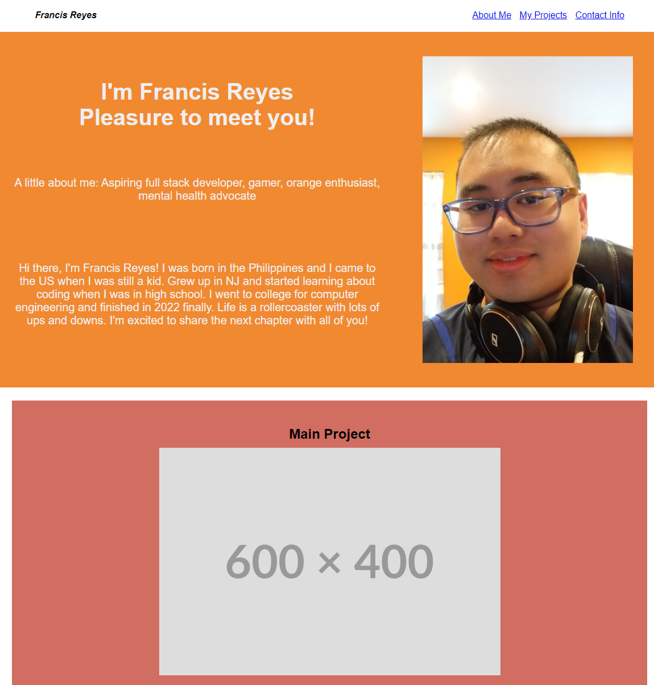
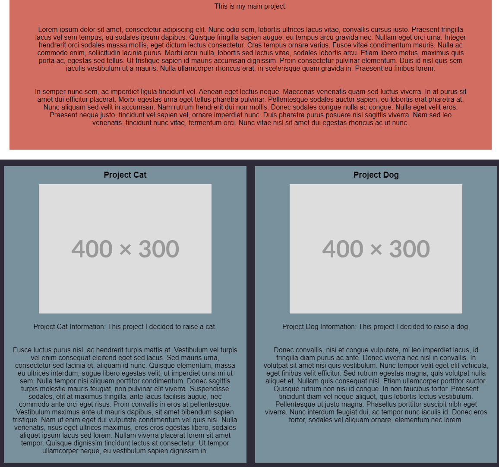
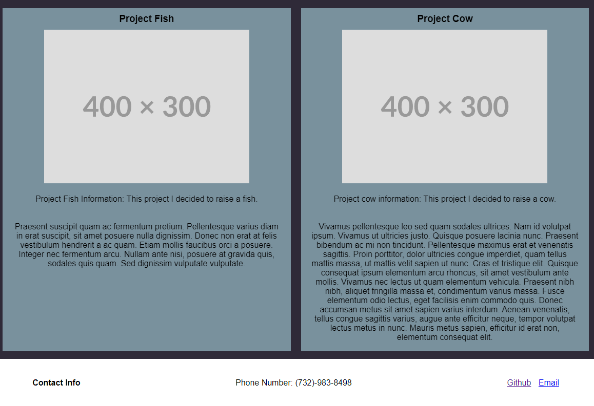

## Webpage Portfolio - Francis Reyes

## Description
The goal of this webpage was to start out with a completely empty file to create a portfolio website from scratch. The main tools used here were HTML and CSS. The code includes various tricks with labeling classes, identifiers, and even some small functions to create the desired visual effects. The layout and structuring was mainly done through the display grid and display flexboxes. Links reference outside sources and those on the page given the appropriate tags. This will be a continuously updated project with transformative 

## Visuals

## Deployment

1st version done as of 5/31/23:

[Portfolio link for Francis Reyes](https://reyesfrancisp.github.io/francis_reyes_portfolio/)

## Usage
Use examples liberally, and show the expected output if you can. It's helpful to have inline the smallest example of usage that you can demonstrate, while providing links to more sophisticated examples if they are too long to reasonably include in the README.

## License
Please refer to the LICENSE in the repo.

## Authors and acknowledgment
- Coded by Francis Reyes